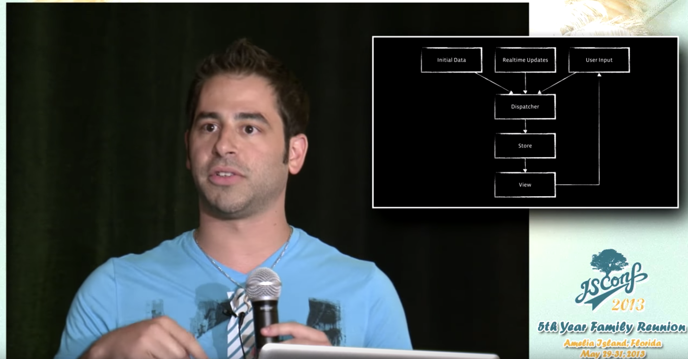

# La Historia de los React Hooks

- 2010

    Obama todavía era presidente, se estrenaba Toy Story 3, el iPad aparecía en nuestras vidas, nacía AngularJS. 

    

    

    

    En un pequeño lugar llamado Facebook, con 600 millones de usuarios registrados, lo estaba petando, pero cuando lo petas, todo tiene sus consecuencias, tus aplicaciones se vuelven más complejas y más difíciles de mantener. Todo mientras te piden "features" como churros.

    

    Facebook tenía que encontrar una solución a esto. Tenía que mejorar el rendimiento de sus aplicaciones y la productividad de sus desarrollados. Como hija de su tiempo y Phpera que es, saco lo que se puede llamar el padre de React: XHP, HTML en PHP. ¿Cómo? 

        <?php
        $post =
          

            <h2>{$post}</h2>
            
Hey there.

            <a href={$like_link}>Like</a>
          
;

    Nacía la convicción de trabajar con componentes en React

        <?php
        class :fb:thing extends :x:element {
          attribute
            string title = "No Title",
            enum { "cool", "lame" } type;
        
        	protected function render() {
            return 
thing
;
          }
        }

- 2011

    Jordan Walke, Software Engineer, crea el primer prototipo de React, llamado FaxJS

        var MainComponent = exports.MainComponent = F.Componentize({
          structure : function() {
            return Div({
              firstPerson: PersonDisplayer({
                name: 'Joe Johnson', age: 31,
                interests: 'hacking, eating, sleeping'
              }),
        
              secondPerson: PersonDisplayer({
                name: 'Sally Smith', age: 29,
                interests: 'biking, cooking swiming'
              }),
        
              thirdPerson: PersonDisplayer({
                name: 'Greg Winston', age: 25,
                interests: 'design and technology'
              })
            });
          }
        });

    

- 2013
    - Lionel Messi gana su cuarto balón de oro.

        

    Se presenta React en la JSConf 2013 en Florida

    

    A tomar por culo el MVC, MVVM, two directional data-binding. 

    

    One Directional data binding (el por qué de esto se queda fuera de la charla), JSX (html in js). Más reconciliación y menos mutación. 

        class HelloMessage extends React.Component {
          render() {
            return (
              

                Hello {this.props.name}
              

            );
          }
        }
        
        ReactDOM.render(
          <HelloMessage name="Taylor" />,
          document.getElementById('hello-example')
        );

- 2015

    Una primera versión de Vue.js Birdman gana el Oscar a la mejor película. No es un año muy bueno para París. Obama sigue siendo presidente.

    

    Netflix y Airbnb usan React y están orgullosos de ello. 

    

    

     Un joven, llamado Dan Abramov,  lanza Redux, la librería que nos llevaría a dar un paso más allá en el desarrollo de aplicaciones con React. Se presenta React Native. No les bastaba con petar la web, había que hacerlo también en mobile, y nada de aplicaciones híbridas. Aplicaciones nativas.

    

    

    Dan Abramov se incorpora Facebook

    [https://twitter.com/dan_abramov/status/671135846830075904](https://twitter.com/dan_abramov/status/671135846830075904)

- 2017

    Donald Trump es presidente. No necesitamos comentar otro evento más.

    

    En la comunidad de React no era suficiente con tener HTML en el Javascript, en 2017 habían empezado a aflorar el CSS-in-js. 

        import styled from 'styled-components';
        // Create a component that renders a 
 element with blue text
        const BlueText = styled.p`
          color: blue;
        `;
        
        <BlueText>My blue text</BlueText>

- 2018

    Trump sigue siendo presidente. 

    

    One directional binding way, JSX, React Native, CSS-in-js. ¿Qué lobby queda por atacar? Había que pensar en algo más adictivo que la  cocaína y lo pete tanto como los vengadores.

    

    

    React Hooks se presentan en ReactConf Iceland de la mano de Sophie Alper, Dan Abramov, ambos de Facebook, y Ryan Florence, creador de React Router y Reach Router.

    

    

    

    Un cambio sin precedentes en la forma de trabajar con React

        import React, { useState } from 'react';
        
        function Example() {
          // Declare a new state variable, which we'll call "count"
          const [count, setCount] = useState(0);
        
          return (
            

              
You clicked {count} times

              <button onClick={() => setCount(count + 1)}>
                Click me
              </button>
            

          );
        }